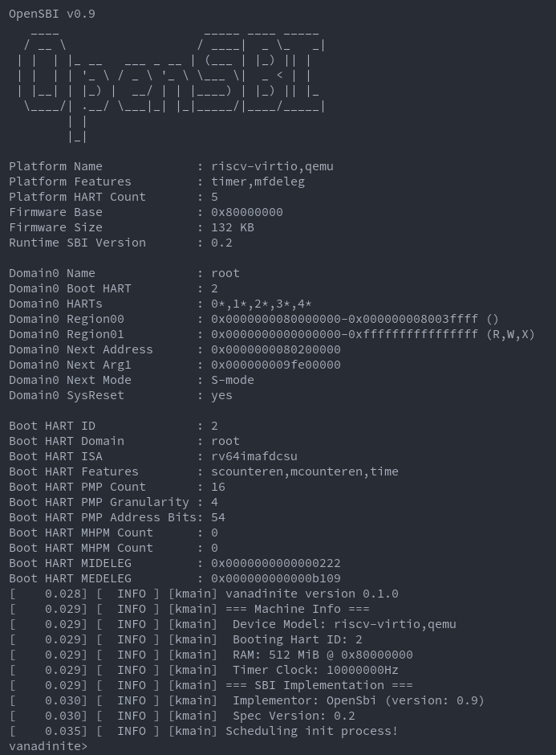

# `vanadinite`

A RISC-V (RV64GC) microkernel written in Rust

## License

The source code in this project is licensed under the Mozilla Public License 2.0

## Building
### Vanadinite and Userspace
The Rust `riscv64gc-unknown-none-elf` toolchain must be installed, then run
`cargo xtask build vanadinite` to build the kernel ELF, or `cargo xtask build
userspace` to build the userspace executables and package them in a tar file in
the root directory. **Note:** building the kernel will automatically build and
package the userspace binaries.

### OpenSBI
Building the OpenSBI firmware image requires you to have the
`riscv64-unknown-elf-` binutils package installed. For Arch users, you can
install the following packages: `riscv64-unknown-elf-gdb`,
`riscv64-unknown-elf-binutils`, `riscv64-unknown-elf-newlib`. If the tools are
installed, run `cargo xtask build opensbi` to build the SBI firmare image and place it
in the root directory for use by QEMU.

## Running
### Requirements
You will need to have the `qemu-system-riscv64` QEMU executable installed and in
your path.

### Running
To run, execute `cargo xtask run`. By default, this will run `vanadinite` on the
QEMU `virt` machine, if you would like to run for a different platform (e.g.
`sifive_u`) or change the machine properties, see `cargo xtask run --help` for a
full list of available options. If QEMU is not installed, the `spike` simulator
can be built and used as an alternative, however it does not support all the
same functionality as running with QMEU. You will also want to pass in
`console=sbi` as a kernel arg to get output.

Default settings are:

            Platform: virt
              # CPUs: 4
                 RAM: 512M
    Kernel Arguments: ""
           Simulator: QEMU

To exit QEMU press: `Ctrl+A` + `x`

## Screenshots!

